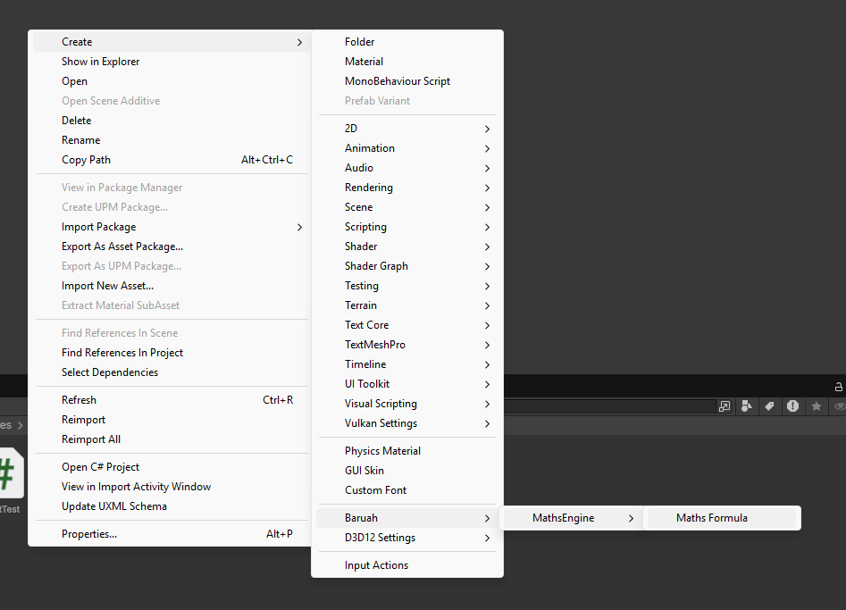

\page getting_started Getting Started

This guide will help you quickly set up and use the MathsEngine in your Unity project.

---

# Installation

1. Open your Unity project.
2. Open **Window → Package Manager**.
3. Click the **+** button in the top-left corner.
4. Select **Add package from git URL**.
5. Enter:
```
https://github.com/arijeetbaruah/Maths-Engine.git?path=Packages/com.arijeet.mathsengine/MathsEngine
```
Unity will download and install the package automatically.

---

# Core Concepts

MathsEngine evaluates **mathematical expressions using nodes**.

Each node represents a mathematical operation.

Examples include:

- Constant values
- Arithmetic nodes (Add, Multiply, Divide)
- Logical nodes
- Comparison nodes

Nodes can reference other nodes to form a **graph**.

When evaluated, the graph propagates values through connected nodes until the final result is produced.

---

# Creating Your First Formula

MathsEngine formulas are stored inside a ScriptableObject called `MathFormula`.

A formula contains a **root node** that defines the calculation.
---

### Step 1 — Create a Formula Asset

In the Unity Project window:

Right Click → Create → Baruah → MathsEngine → Maths Formula



Name the asset:
```
DamageFormula
```

This asset will hold the full node graph.

---

### Step 2 — Configure the Node Graph

Inside the `MathFormula` asset assign a root node to **Math Node**.

Example graph:
```
(5 + 3) * 2
```
Node structure:
```
Multiply
├─ Add
│ ├─ Constant(5)
│ └─ Constant(3)
└─ Constant(2)
```
---

### Step 3 — Evaluate the Formula

You can evaluate the formula from any script.

```csharp
using Baruah.MathsEngine.Core;
using UnityEngine;

public class FormulaExample : MonoBehaviour
{
    [SerializeField]
    private MathFormula formula;

    void Start()
    {
        float result = formula.Calculate();
        Debug.Log(result);
    }
}
```
Output:
```
16
```
___

## Viewing the Equation

The formula asset will display the equation automaticall[custom-nodes.md](custom-nodes.md)y.

Example:

(5 + 3) * 2 = 16

This is generated by the ToEquation() method.
___

## Passing Parameters

Some nodes can use external parameters when evaluating the formula.

Example:
```csharp
float result = formula.Calculate(playerAttack, enemyDefense);
```

The meaning of parameters depends on the nodes used in the graph.
